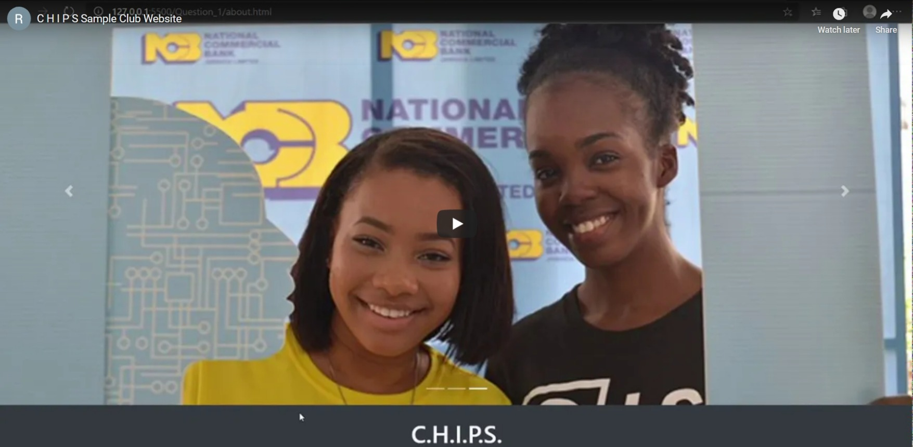
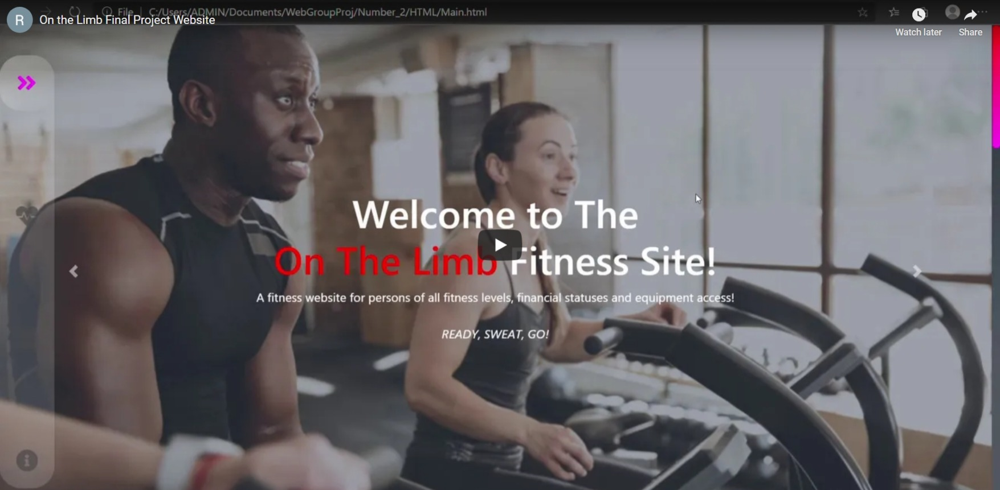

# Final Project - Website Design And Implementation
This repository contains the Final Project for the Website Design and Implementation course

## About Group 3
The group members that contributed to this project are:
* Daltonett Griffiths
* Kandrea Alfred
* Robert McFarlane
* Tyreek Alexander

## Websites

According to the instructions given, there are two (2) main folders, each with a separate web project.

### 1. Club Website

##### See demo below:

This website serves the purpose of presenting the official C.H.I.P.S. club website. This website gives users the ability to be informed of current happenings of the club, the reason why the club exists, the executive team and an oppurtunity to log-in to their account or to join the C.H.I.P.S. family.

* ### Index
The purpose of this page is welcome the users to the official C.H.I.P.S. website. The page gives the user an invitation to join the page, the mission of the club, the top stories, and our contact information in the footer.

* ### About Us
The purpose of this page is to explain to the user the reason why the club exists. The page gives a brief description of the club, a "What we do" section exhibiting what the club has done/is doing for its members and a slideshow of pictures of C.H.I.P.S. related events in the past.

* ### Meet Our Members
The purpose of this page is the let the user be aware of the regime for the current academic year.

* ### Contact Us
This page serves the purpose of giving the user an oppurtunity to reach out the the executive team. The user is able to give there name, email, the purpose of the enquiry, their message, and an oppurtunity to join the clubs newsletter.

* ### Sign up/ Login
This page serves the purpose of allowing the user to either Log-in to their existing account or to sign-up to join the C.H.I.P.S. family.

### 2. On The Limb - Fitness Site

##### See demo below:

The purpose of the site is to present exercises for persons of varying levels of fitness, all without a cost. It was created as a single page application (SPA), meaning all actions and links taken on the page will take place on the same page. Below are the sections one can expect to find on the website
  
* #### Navigation Bar
The navigation bar is, by default fixed to the left of the screen. It contains four (4) icons, each representing one of the four major sections of the page (which will be       discussed further down).
  
* #### Home
Upon opening the website, the first thing you will see is the home page. It is a slideshow which briefly explains what is being offered on the site.

* #### Exercise
This section contains all the exercises that persons may wish to engage in. It first shows an overview page and a button that reveals the fitness level options that the person   is at. When the appropriate level is selected they will be told who the level is for and a button will lead them to the next step.
When they click this button, they will be given two options for the purpose of their exercise. Whenever an option is selected, their exercise plan will be shown.

* #### Upcoming Events
The section entails the upcoming events planned for the month of December. We made the dates visible and gave details on the purpose and the venue. It was also designed to be engaging as you just have to hover over the date to see a pop up of the scheduled event and all things pertaining to that particular upcoming event. For ever month that the website would have new activites the site would be updated to that particular month. 

* #### About Us
This was just to give information on the site, to let the visitors who use our platform know what we are about. It gives information on our organization, where to find us on social media, ways to donate and most critically, the disclaimer to prevent injury to any user and stay clear of lawsuits. If transactions were to be made ot the site, their card information would not be stored on the site, therefore their financial idenity would be safe. 
